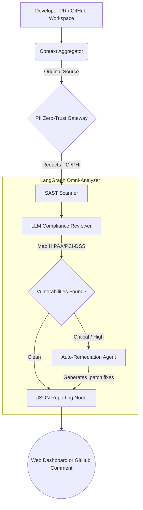

# Omni-Analyzer: Enterprise AI Security Agent 🛡️

A zero-trust, LangGraph-orchestrated AI Security Agent built for highly regulated environments (Finance, Healthcare). Omni-Analyzer doesn't just passively scan code—it purposefully redacts PII before cloud processing, maps logical flaws directly to compliance frameworks like **HIPAA** and **PCI-DSS**, and auto-generates secure `.patch` refactoring code.

## 🏗️ Architecture



## ✨ Key Features
1. **PII Sanitization Gateway**: Uses Microsoft Presidio & Spacy to ensure sensitive patient/payment data never leaves the network.
2. **Auto-Remediation Patching**: If a critical vulnerability is found, the agent surgically authors a unified `.patch` file containing secured logic (e.g., standardizing AES-256 Encryption) so it can automatically attach to your GitHub PR.
3. **CI/CD Integration**: Natively runs on `pull_request` hooks via the included `action.yml` and `ci_runner.py` block. Prevents insecure API logic from ever entering the `main` branch.
4. **Interactive Dashboard**: A custom React/Vite interface featuring a modern SOC dark-mode aesthetic for security analysts.

## 🚀 Quickstart

You can spin up the full decoupled platform locally in isolated environments.
Make sure you have Docker installed.

1. Clone the repository.
2. Set up your `.env`:
   ```bash
   cp .env.example .env
   ```
3. Boot the environment!
   ```bash
   docker-compose up --build -d
   ```
   **Frontend Application**: `http://localhost:8080`
   **FastAPI Engine**: `http://localhost:8000/docs`

## 🛡️ Implementation Details

### The Zero-Trust PII Redactor (`core/pii_redactor.py`)
Before the LLM engine even sees your code, the Agent intercepts it. Hardcoded secrets, SSNs, credit card schemas, and healthcare data are replaced dynamically:
`cc_log = processed {amount} for {patient_name}` -> `cc_log = processed {AMOUNT} for {PERSON}`.

### CI/CD Runner (`action.yml`)
Embeds this tool into your GitHub workflows via Docker! The scanner points to your `$GITHUB_WORKSPACE` and intentionally returns `sys.exit(1)` upon `HIGH` threat detection, acting as an enterprise-grade automated gate.
