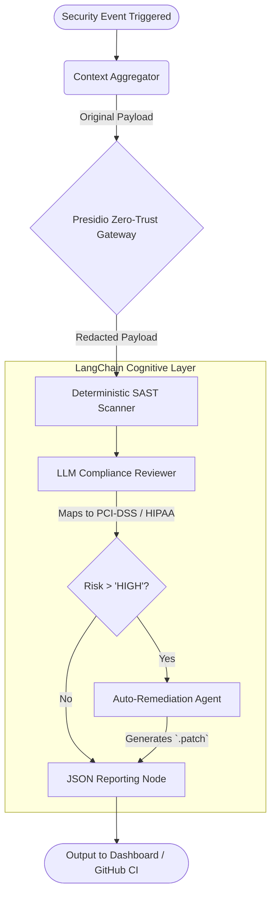

# Omni-Analyzer: Core Architecture Specification

## Abstract
The Omni-Analyzer is a Zero-Trust AI Security Agent built upon **LangGraph**, **Microsoft Presidio**, and **LangChain**. Its singular mission is to detect logic and compliance flaws within a codebase (and automatically author secure refactors) without ever unnecessarily leaking proprietary internal secrets or Personal Health Information (PHI) to an external cloud AI model.

---

## 🏗️ State Machine (LangGraph Orchestrator)
The backend behaves as a deterministic Directed Acyclic Graph (DAG) state machine. A single payload traverses multiple specialized agents sequentially, preventing AI hallucinations from skipping critical security steps.

## 🔒 Module Detail

### 1. `Context Aggregator` (`src/core/context_aggregator.py`)
Responsible for crawling directories safely. It intelligently ignores heavy cache/dependency directories (`node_modules`, `venv`, `.git`) and scoops only strictly typed logic files (`.py`, `.ts`, `.js`, `.go`, `.java`).

### 2. `PII Redactor Gateway` (`src/core/pii_redactor.py`)
This is the core of the zero-trust paradigm. The agent uses `presidio_analyzer` powered by `spacy` (`en_core_web_lg`) to detect known patterns like Credit Cards, SSNs, IBANs, and Email Addresses. Before handing source code over to any cloud LLM, it actively replaces variables (e.g., `ssn_log="User Social: 123-45-678"` -> `[REDACTED_US_SSN]`).

### 3. `SAST Scanner` (`src/agents/sast_scanner.py`)
A fast, deterministic safety-net that operates synchronously to catch extreme low-hanging fruit (like hardcoded DB credentials or massive SQL injection structures) using regex lexers, thus saving LLM tokens.

### 4. `Compliance Reviewer` (`src/agents/compliance_reviewer.py`)
Leverages deep associative intelligence against established frameworks like GDPR Art. 32, PCI-DSS Req 3.4, and HIPAA Sec. 164. The LLM reviews the masked codebase and identifies vulnerabilities where an engineer failed to employ standard encryption, mapping the failure to the exact regulatory risk.

### 5. `Auto-Remediation Agent` (`src/agents/remediation_agent.py`)
The capstone of the AI solution. Instead of just flagging a vulnerability during CI/CD, this secondary LLM instance is fed the exact broken snippet and outputs a specialized Unified Format Git Diff (`.patch`). It writes the secure code implementation (like symmetric AES encryption standard injections) on the developer's behalf.
